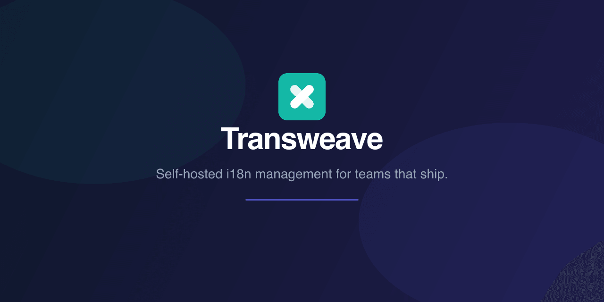
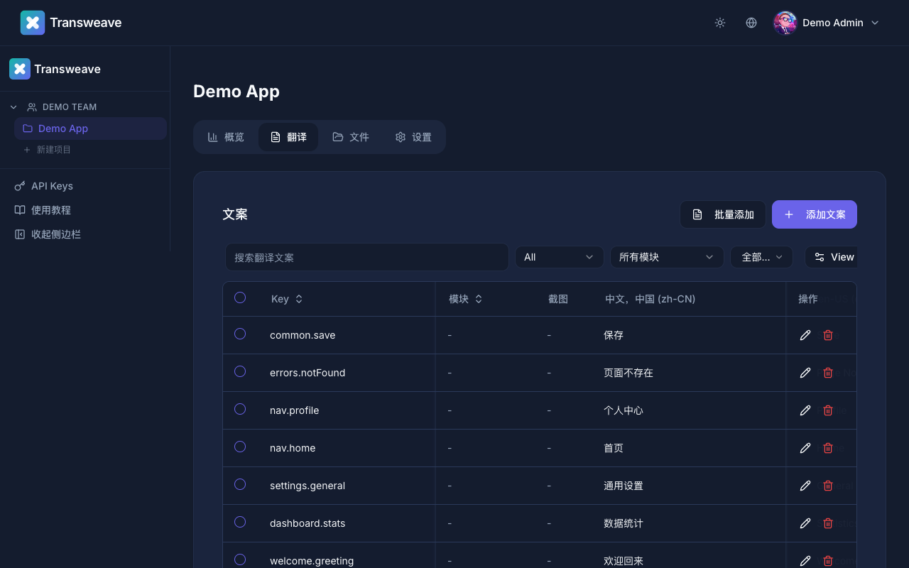

<p align="center">
  
</p>

<p align="center">
  <b>自托管国际化管理平台</b> &nbsp;|&nbsp; <a href="./README.en.md">English</a>
</p>

<p align="center">
  
</p>

- 多语言翻译管理，支持模块和命名空间
- 团队协作，基于角色的访问控制（所有者 / 管理员 / 成员）
- AI 辅助翻译，支持 OpenAI、Claude、DeepL 或 Google Translate（可选，自带 API key）
- 导入导出支持 JSON、YAML、CSV、XLIFF 和 Gettext（.po）格式
- CLI 工具用于 CI/CD 集成（`transweave pull` / `transweave push`）
- MCP 服务，供 AI 编程助手调用
- PGlite 支持零配置本地开发（无需安装 PostgreSQL）

**技术栈：** Next.js、NestJS、PostgreSQL / PGlite、Drizzle ORM、pnpm monorepo

## 一键部署到 Render（免费）

[](https://render.com/deploy?repo=https://github.com/Muluk-m/transweave)

> 点击按钮，用 GitHub 账号登录 Render，点击 Apply 即可自动创建所有服务。

## Docker 快速开始

```bash
# 1. 克隆仓库
git clone https://github.com/Muluk-m/transweave.git
cd transweave

# 2. 配置环境变量
cp .env.example .env
# 编辑 .env，设置以下两个必填项：
#   POSTGRES_PASSWORD=<强密码>
#   JWT_SECRET=$(openssl rand -base64 64)

# 3. 启动平台
docker compose up -d
```

打开 http://localhost:3000。首次启动时，应用会自动跳转到 `/setup` 页面，在那里创建管理员账号和第一个团队。完成后即可正常登录。

## 本地开发快速开始（PGlite）

无需安装 PostgreSQL。当 `DATABASE_URL` 未设置时，PGlite 会自动运行嵌入式数据库，数据写入磁盘，重启后不丢失。

```bash
# 1. 克隆并安装依赖
git clone https://github.com/Muluk-m/transweave.git
cd transweave
pnpm install

# 2. 配置环境变量（JWT_SECRET 是唯一必填项）
cp .env.example packages/server/.env
# 编辑 packages/server/.env，设置：
#   JWT_SECRET=$(openssl rand -base64 64)
# 保持 DATABASE_URL 注释状态 —— PGlite 会自动使用。

# 3. 启动后端
pnpm dev:server

# 4. 启动前端（新终端）
pnpm dev:web
```

打开 http://localhost:3000。首次启动时，应用会自动跳转到 `/setup` 页面，在那里创建管理员账号和第一个团队。完成后即可正常登录。

## 环境变量

所有变量在 `.env.example` 中定义。复制后按需编辑。

| 变量 | 必填 | 默认值 | 说明 |
|------|------|--------|------|
| `DATABASE_URL` | Docker: 是，本地: 否 | -- | PostgreSQL 连接字符串。留空则使用 PGlite。 |
| `POSTGRES_DB` | 否 | `i18n` | PostgreSQL 数据库名（仅 Docker Compose）。 |
| `POSTGRES_USER` | 否 | `i18n` | PostgreSQL 用户名（仅 Docker Compose）。 |
| `POSTGRES_PASSWORD` | Docker: 是 | -- | PostgreSQL 密码（仅 Docker Compose）。 |
| `JWT_SECRET` | 是 | -- | JWT Token 签名密钥。用 `openssl rand -base64 64` 生成。 |
| `PORT` | 否 | `3001` | 后端 API 监听端口。 |
| `UPLOAD_DIR` | 否 | `./uploads` | 上传文件存储目录（截图等）。 |
| `NEXT_INTERNAL_API_URL` | 否 | `http://server:3001` | Docker 网络内部服务端渲染使用的后端地址。 |
| `WEB_PORT` | 否 | `3000` | Web UI 对外暴露的端口（仅 Docker Compose）。 |
| `AI_PROVIDER` | 否 | -- | AI 翻译服务商：`openai`、`claude`、`deepl` 或 `google`。留空则禁用。 |
| `AI_API_KEY` | 否 | -- | 对应 AI 服务商的 API key。 |
| `PGLITE_DATA_DIR` | 否 | `./data/pglite` | PGlite 数据目录（`DATABASE_URL` 未设置时生效）。 |


## 架构

```
transweave/
  packages/
    server/     NestJS API（认证、团队、翻译、AI、文件存储）
    web/        Next.js 前端
    cli/        CI/CD 集成 CLI 工具
```

- **数据库：** 生产环境使用 PostgreSQL（Docker），本地开发使用 PGlite（零配置）。
- **文件存储：** 本地磁盘。Docker 下通过 named volume 持久化。
- **Monorepo：** 使用 pnpm workspaces 管理。

## 开发

**前置条件：**

- Node.js >= 22
- pnpm >= 10.8.0

**运行测试：**

```bash
pnpm --filter @transweave/server test:e2e
```

**Drizzle Studio**（数据库浏览器）：

```bash
pnpm --filter @transweave/server drizzle-kit studio
```

## Docker 详情

### 服务

| 服务 | 镜像 / 构建 | 端口 | 说明 |
|------|------------|------|------|
| `postgres` | `postgres:17-alpine` | 仅内部 | PostgreSQL 数据库，含健康检查 |
| `server` | `packages/server/Dockerfile` | 仅内部 | NestJS API 服务 |
| `web` | `packages/web/Dockerfile` | `${WEB_PORT:-3000}:3000` | Next.js 前端 |

### 数据卷

| 卷名 | 容器路径 | 用途 |
|------|---------|------|
| `pgdata` | `/var/lib/postgresql/data` | PostgreSQL 数据（重启后保留） |
| `uploads` | `/app/uploads` | 上传文件（截图等） |

### 常用命令

```bash
# 代码变更后重新构建
docker compose build && docker compose up -d

# 查看服务端日志
docker compose logs -f server

# 停止（数据保留在 volume 中）
docker compose down

# 重置所有数据（警告：删除数据库和上传文件）
docker compose down -v
```

## 故障排除

**无法登录 / 登录页不接受账号密码**
全新安装时数据库中没有任何用户。应用打开时会自动跳转到 `/setup` 页面。如果未自动跳转，请直接访问 http://localhost:3000/setup，创建管理员账号和第一个团队。

**服务端无法启动**
所有配置下 `JWT_SECRET` 都是必填项。Docker 还额外需要 `POSTGRES_PASSWORD`。请检查 `.env`（Docker）或 `packages/server/.env`（本地）是否都已设置。

**重启后数据丢失（Docker）**
请使用 `docker compose down`，而非 `docker compose down -v`。`-v` 参数会删除 named volume 及其中的所有数据。

**重启后数据丢失（本地 PGlite）**
检查 `packages/server/.env` 中 `PGLITE_DATA_DIR` 是否指向固定路径（默认：`./data/pglite`）。如未设置该变量，数据存储在服务端启动目录下的 `./data/pglite`。

**端口被占用**
修改 `.env` 中的 `WEB_PORT`（Docker）或 `PORT`（本地）为可用端口。

**本地开发 PGlite 报错**
删除 PGlite 数据目录后重启（此操作会重置所有数据）：
```bash
rm -rf data/pglite
pnpm dev:server
```

## 贡献

本项目使用 [Conventional Commits](https://www.conventionalcommits.org/)。提交信息请以 `feat:`、`fix:`、`docs:`、`chore:` 等前缀开头。

```bash
git commit -m "feat: add new export format"
```

## License

MIT
